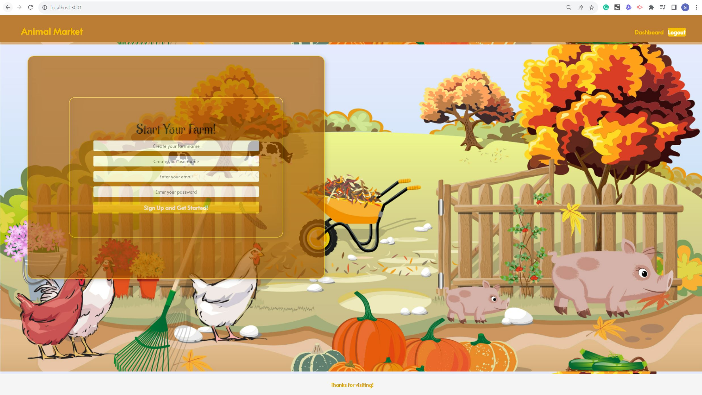

# Animal Market

## Overview ##
We will be building a web game called Animal Farm 

where players can raise and take care of virtual animals on their own farm. 

Upon opening the web browser, users are prompted to enter

their username, email, and password to start the game. 

Once logged in, they are presented with a

default farm name which can be changed. 

The default farm comes with initial animals including

a chicken, sheep, and duck, along with a starting fund of 10,000.

## Table of Contents
- [Installation](#installation)
- [Usage](#usage)
- [Risk Management Report](#Risk-Management-Report)
- [Configuration Management Report](#Configuration-Management-Report)
- [Testing Report](#testing-report)
- [Contributing](#contributing)
- [Questions](#questions)

## Installation
To generate your own note taker, ``git clone`` the repo down to your local so you have the Node project on your local. 

Run ``npm install`` in order to install the following npm package dependencies as specified in the package.json. 

The application will start by running ``npm start`` in the command line. 

Then you can go to http://localhost:3001 to view your app.

You can test each module by running ``npm run test``.
## Usage
* GIVEN I am using a virtual farm to raise animals,  
  * WHEN I open the application    
    THEN the user name, email, and password should be presented to start
  * WHEN I login in   
    THEN I am presented with a default farm name and I’m able to change it to another name
  * WHEN I login in    
    THEN I am presented with a default farm with initial animals including one chicken, sheep, and duck and fund number as 5000. 
  * WHEN I login in 
    THEN I am presented with animal market button.
  * WHEN I click the animal market button
    THEN I’m directed to the animal market page with available animals on the markets including animal name, sell price, cost price, and buttons of selling, buying, and close. 
    Note that in animal markets page, it should also display what animals that user own to allow them make decisions on selling or buying.
  * WHEN I click button of selling
    THEN I’m presented with prompted window including number box for user to enter and buttons of submit and cancel
  * When I click the button of submit on selling window,
    THEN the number of owned animal from user should be dedected; Meanwhile, the number of animal from market should be added;
      Money user owned should be added
  * WHEN I click button of buying
    THEN I’m presented with prompted window including number box for user to enter and buttons of submit and cancel
  * When I click the button of submit on buying window,
the number of owned animal from user should be added; Meanwhile, the number of animal from market should be reduced;
Money user owned should be reduced
  * WHEN I click button of cancel
    THEN either buying window or selling window should be closed and I’m presented on animal market page.

## Risk Management Report
* Project Overview
  * The "Animal Farm" web game project involves the development of an interactive virtual farm simulation game with two different versions, each offering unique features and enhancements.

* Objective
  * The project aims to create an engaging and user-friendly web-based game where players can raise virtual animals, manage their farm, and experience interactive gameplay.

* Scope
  * The project scope includes user registration, login, farm management, animal market functionality, and enhanced user interaction (Version 2).

* Risk Identification and Assessment:

  * Risk 1: Complex Interaction Logic
    	
      Category: technical risks
      
      Impact: High
      
      Probability: Moderate
      
      Total Risk Score: 6
      
      Documentation and Reasoning: The new interaction mechanics in Version 2 introduce complex logic, increasing the potential for bugs and inconsistencies.

  * Risk 2: Usability Challenges
     
     Category: User Experience Risks
     
     Impact: Moderate
     
     Probability: Moderate
     
     Total Risk Score: 4
     
     Documentation and Reasoning: Enhanced features in Version 2 may lead to user confusion and difficulties navigating the interface.
      
  * Risk 3: Monetization Effectiveness
     
     Category: Financial
     
     Impact: Moderate
     
     Probability: Moderate
     
     Total Risk Score: 4
     
     Documentation and Reasoning: The success of monetization strategies in Version 2 is uncertain and could affect revenue generation.

  * Risk 4: Third-Party Services
     
     Category: Technical Dependencies
     
     Impact: Moderate
     
     Probability: Low
     
     Total Risk Score: 3
     
     Documentation and Reasoning: Reliance on external services (e.g., Heroku) could lead to potential service interruptions impacting game availability.

  * Risk 5: Code Conflicts
     
     Category: Version Control Challenges
     
     Impact: Low
     
     Probability: Low
     
     Total Risk Score: 1
     
     Documentation and Reasoning: Multiple developers working on different features may encounter code conflicts during integration.

* Risk Mitigation and Control:

  * Risk 1: Complex Interaction Logic:
      
      Mitigation Plan: Conduct thorough code reviews and extensive testing of interaction mechanics to identify and address potential bugs.
      
      Historical Records: Maintain a record of identified issues and actions taken to resolve them.

  * Risk 2: Usability Challenges:
      
      Mitigation Plan: Engage users in usability testing and implement iterative design updates based on feedback.
      
      Historical Records: Document usability testing results and design changes.

  * Risk 3: Monetization Effectiveness:
      
      Mitigation Plan: Continuously monitor user engagement, analyze player behavior, and adapt monetization strategies as needed.
      
      Historical Records: Keep track of revenue data and adjustments made to monetization approaches.

  * Risk 4: Third-Party Services
      
      Mitigation Plan: Establish contingency plans for service disruptions, such as having an alternative hosting solution in place.
      
      Historical Records: Maintain a log of service availability and any instances of disruptions.

  * Risk 5: Code Conflicts
      
      Mitigation Plan: Enforce version control guidelines, use feature branches, and conduct regular code reviews to prevent and address code conflicts.
      
      Historical Records: Document code conflicts and resolutions during integration.
       
* Week-by-Week Risk Management:

* Conclusion:
  * The risk management approach for the "Animal Farm" web game project involves thorough risk identification, assessment, mitigation, and control strategies. By categorizing and evaluating potential risks, assigning impact and probability scores, implementing mitigation plans, and maintaining historical records, the project team aims to address challenges and uncertainties effectively throughout the 8-week development timeline.

## Configuration Management Report

* Introduction:

  * This report details the configuration management practices adopted for the Animal Farm Web Game project. Utilizing the principles of GitHub as our version control system, we have maintained rigorous standards to ensure quality and reliability throughout the project lifecycle.

* Change Control Process:

  * Change Control Workflow:

     Initiation: A software change request (SCR) is proposed by any member, describing the change, its purpose, and its potential impact.
     
     Review: The team reviews the SCR to assess its feasibility, impact, and estimated implementation time.
     
     Approval/Rejection: Post review, the SCR is either approved or rejected. If rejected, feedback is provided.
     
     Implementation: If approved, the change is implemented in a separate branch (not master).
     
     Testing: Post-implementation, rigorous tests are carried out to ensure the change hasn't negatively impacted the system.
     
     Merge: Once tested and deemed successful, the change is merged into the master branch.
     
     Close: The SCR is closed and documented with the date, details of the change, and the person responsible.

  * States of Software Change Request (SCR):

     Open: The SCR has been proposed but not yet reviewed.
     
     Under Review: The SCR is currently being considered by the team.
     
     Approved: The SCR has been accepted for implementation.
     
     Rejected: The SCR will not be implemented. Reasons for rejection are documented.
     
     In Progress: The change is currently being implemented.
     
     Tested: The change has undergone testing.
     
     Merged: The change has been integrated into the master branch.
     
     Closed: The SCR process for the particular request has concluded.

* Branching and Tagging Scheme:

  * Branching:

     Master Branch: This is the main branch containing the stable and tested version of the software.
     
     Development Branches: For every SCR or feature addition, a new branch is created. E.g., if a new animal type is to be added, a branch named "add-new-animal" might be created.

  * Tagging:

     Upon completion and thorough testing of a software version, the master branch is tagged with the version number. This ensures easy retrieval of previous versions. For instance, after the successful implementation of Version 1, it would be tagged as "v1.0".

* Tool Use:

  * GitHub for Version Control:

     All software components are placed in our GitHub repository. The repository is structured to ensure easy tracking of changes, with every SCR resulting in a new branch.

  * Branching and Tagging in Practice:

     For every SCR, a dedicated branch is created. Post its successful testing, it is merged to the master branch. Once a version is deemed complete, it is tagged appropriately to denote its version number.

  * Repository Access:

     The instructor has been granted 'read' access to the repository. This ensures transparency and allows for periodic review.

* Documentation:

  * Alongside the source code, every SCR, branch, and tag is accompanied by detailed documentation. This covers the change's purpose, its implementation details, and its impact.

* Conclusion:

  * The Animal Farm Web Game project has been developed with a stringent focus on maintaining quality, reliability, and transparency. By adhering to the best practices in configuration management and leveraging the power of version control systems like GitHub, we ensure the project's integrity and success.

## Testing Report
Please run ``npm run test`` test the application.

* Testing Objective:

  * Verify that the virtual farm application functions as expected, allowing users to manage their virtual farm, buy and sell animals, and handle transactions accurately.

* Scope:

  * This test plan covers testing for the virtual farm application's core features, including user login, farm management, animal market interaction, buying and selling animals, and transaction handling.

* Test Environment:

  * Testing Environment: Virtual machine/Device with required specifications
Browser/Platform: Compatible browsers and devices

  * Test Data: Various sets of test data for different scenarios

* Test Case Selection Methodology:

  * The test cases were selected based on different functional aspects of the virtual farm application. We aimed to cover a range of scenarios including initial setup, market interaction, buying and selling animals, and handling transactions. The goal was to ensure comprehensive coverage of the core application features, considering both successful and edge cases.

* Test Scenarios:

  * Scenario 1: Initial User Login and Farm Setup
    * Open the application.
    * Verify that the user is prompted to enter their name, email, and password.
    * Enter valid credentials and click the "Start" button.
    * Verify that the default farm name is displayed.
    * Verify that the user can change the farm name to another valid name.
  * Test Procedure 1

| Test Step	Description  | Expected Result  |  Actual Result |
|---|---|---|
|1	Open the application.   |  Application opens successfully. | PASS  | 
|2	Enter valid credentials and click "Start".   | User is logged in successfully.  |  PASS |
|3	Verify default farm name is displayed.  | Default farm name is displayed.	  | PASS  | 
|4	Enter a new farm name and click "Change Name".|	Farm name is updated with the new value.|	PASS|

  * Scenario 2: Default Farm Setup
    * Login to the application.
    * Verify that the default farm is displayed with initial animals (chicken, sheep, duck).
    * Verify that the initial fund amount is set to 5000.
  * Test Procedure 2

|Test Step	Description	|Expected Result|	Actual Result|
|---|---|---|
|1	Login to the application.|	User is logged in successfully.|	PASS|
|2	Verify default farm animals and funds.	|Initial animals and funds are displayed correctly.	|PASS|
  * Scenario 3: Animal Market Access
    * Login to the application.
    * Click on the "Animal Market" button.
    * Verify that the user is directed to the animal market page.
    * Verify that the available animals for buying and selling are displayed, including their attributes (name, sell price, cost price).
    * Verify that the animals owned by the user are also displayed.
  * Test Procedure 3

|Test Step	Description|	Expected Result|	Actual Result|
|---|---|---|
|1	Login to the application.|	User is logged in successfully.|	PASS|
|2	Click on "Animal Market" button.|	Animal market page opens.|	PASS|
|3	Verify available animals and user-owned animals.|	Animals are displayed with correct attributes.|	PASS|

  * Scenario 4: Selling Animals
    * Follow steps 1-3 from "Animal Market Access."
    * Click the "Sell" button for a specific animal.
    * Enter a valid number of animals to sell in the prompted window.
    * Click the "Submit" button.
    * Verify that the user's owned animal count decreases by the sold amount.
    * Verify that the market's animal count increases by the sold amount.
    * Verify that the user's funds increase based on the sale.
  * Test Procedure 4

|Test Step	Description|	Expected Result|	Actual Result|
|---|---|---|
|1	Follow steps 1-3 from "Animal Market Access."|	Animal market page opens.|	PASS|
|2	Click "Sell" button for a specific animal.|	Selling window opens.|	PASS|
|3	Enter a valid number of animals and click "Submit".|	User-owned animal count decreases, market animal count increases, user funds increase.|	PASS|

  * Scenario 5: Buying Animals
    * Follow steps 1-3 from "Animal Market Access."
    * Click the "Buy" button for a specific animal.
    * Enter a valid number of animals to buy in the prompted window.
    * Click the "Submit" button.
    * Verify that the user's owned animal count increases by the bought amount.
    * Verify that the market's animal count decreases by the bought amount.
    * Verify that the user's funds decrease based on the purchase.
  * Test Procedure 5

|Test Step	Description|	Expected Result|	Actual Result|
|---|---|---|
|1	Follow steps 1-3 from "Animal Market Access."|	Animal market page opens.|	PASS|
|2	Click "Buy" button for a specific animal.|	Buying window opens.|	PASS|
|3	Enter a valid number of animals and click "Submit".|	User-owned animal count increases, market animal count decreases, user funds decrease.|	PASS|

  * Scenario 6: Canceling Transactions
    * Follow steps 1-3 from "Animal Market Access."
    * Click the "Buy" or "Sell" button for a specific animal.
    * Click the "Cancel" button in the prompted window.
    * Verify that the prompted window is closed.
    * Verify that the user is returned to the animal market page.
  * Test Procedure 6

|Test Step	Description|	Expected Result|	Actual Result|
|---|---|---|
|1	Follow steps 1-3 from "Animal Market Access."|	Animal market page opens.|	PASS|
|2	Click "Buy" or "Sell" button for a specific animal.|	Buying/Selling window opens.|	PASS|
|3	Click "Cancel" button in the window.|	Buying/Selling window is closed, user is back on the market page.|	PASS|

* Test Deliverables:
    * Test scenarios with expected results.
    * Test data used for various scenarios.
    * Test cases execution results.
## Contributing
Please follow the industry standard.

## Questions

This is my Github Profile [https://github.com/j7gong](https://github.com/j7gong/). If you have any additional questions, please reach me at gongjingsi@hotmail.com
